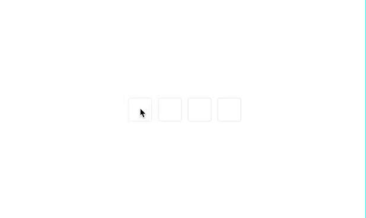

# 短信验证码code输入框

> 默认4位

## 效果展示



## 局部引入
```vue
<template>
  <SmsCodeInput v-model="code" :length="6" />
</template>

<script setup>
import '@agarics/sms-code-input/style.css'
import { SmsCodeInput } from '@agarics/sms-code-input'
const code = ref('')
</script>
```

## 全局引入

### 入口注册
```js
import { createApp } from 'vue'
import SmsCodeInput from '@agarics/sms-code-input'
import '@agarics/sms-code-input/style.css'
import App from './App.vue'

const app = createApp(App)
app.use(SmsCodeInput)
app.mount('#app')

```
### 组件中使用
```vue
<template>
  <sms-code-input v-model="code" :length="6" />
</template>

<script setup>
const code = ref('')
</script>
```